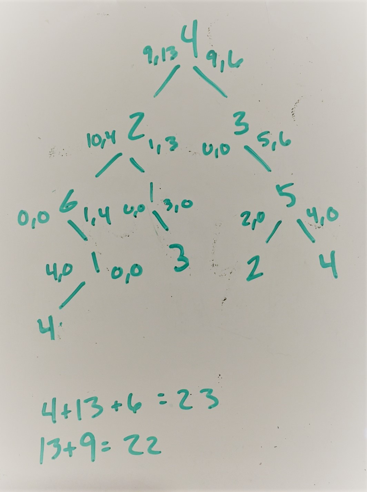

# House Robber III

[https://leetcode.com/problems/house-robber-iii/](https://leetcode.com/problems/house-robber-iii/)

---
The thief has found himself a new place for his thievery again. There is only one entrance to this area, called the "root." Besides the root, each house has one and only one parent house. After a tour, the smart thief realized that "all houses in this place forms a binary tree". It will automatically contact the police if two directly-linked houses were broken into on the same night.

Determine the maximum amount of money the thief can rob tonight without alerting the police.

Example 1:
```
Example 1:

Input: [3,2,3,null,3,null,1]

     3
    / \
   2   3
    \   \ 
     3   1

Output: 7 
Explanation: Maximum amount of money the thief can rob = 3 + 3 + 1 = 7.
```

Example 2:
```
Input: [3,4,5,1,3,null,1]

     3
    / \
   4   5
  / \   \ 
 1   3   1

Output: 9
Explanation: Maximum amount of money the thief can rob = 4 + 5 = 9.
```
---

## My thoughts

This is the third of three variants on the House Robber series.  The first two however, deal with arrays of numbers, whereas this third variant deals with a binary tree.  At first, I thought maybe I could do a traversal of the tree to get all the number in a specific order and then use the same (or similar) technique that I used for House Robber I or House Robber II.  

However, you'll see quickly that this won't work.  Since we've got a binary tree, it means that any given node might have up to 3 direct neighbors (its parent, its left child, and its right child).  Representing neighbors that way doesn't lend itself well to plain sequence of numbers.

## Can we do this in just one traversal of the tree?

Maybe we can.  Imagine the following tree (it will be my example tree as I go through this problem):

```
      4
    /   \
   2     3
  / \     \
 6   1     5
  \   \   / \
  1    3 2   4
 /
4
```

For a moment, assume you knew the maximum amount of money the robber could get in just the left half of the tree and also in the right half.  Don't bother figuring it out; I will tell you.  The best you can do in the left half is 13 and the best you can do in the right half is 9.  That would give you 13 + 9 = 22.  However, that is **not** the answer.  The answer is actually 23.  What gives?

Remember that the robber cannot rob adjacent houses (which in this case, means any two houses that are directly connected).  That means that there are actually two answers on each side of the root.  There is the "best" answer which **includes** the root's left-child (2) and there is the "best" answer that **does not** include the root's left child.

Similarly, on the right side of the root, there are also two such answers: one which includes the root's right child (3) and one that does not.

## Which "best" answer to choose?

What if I told you what the two "best" answers on the left side of the tree were, and futher, if I told you which of the two answers included the left child (2) and which of the two did not?  And of course, on the right side, I will give you the same bit of information.

---
### left options
On the left, the two answers are: [ 9, 13 ] (let's call this array *left*), where the first element (9) is the answer that **includes** the left-child of the root (2) and the second element (13) **does not** include the left-child of the root (2).

### right options
On the right, the two answers are: [ 9, 6 ] (let's call this array *right*), where the former value includes the right-child (3) and the latter does not.

---

Now if we choose *left[0]* (which is 9), then we're choosing to include the left-child (2), so we may **not** include the value of the root itself (4) in our total (because the left-child of the root is adjacent to it!).

Similarly, if we choose *right[0]* (which also happens to be 9) then again, we may **not** include the root value for the same reason (its right-child is adjacent to it).

## To include or not to include

Perhaps a better way to think about it though, is to consider whether or not you will include the root in your calculation.  If you do, then you may **only** consider options from *right* and *left* which **do not** include children of the root (in this example, what would be *left[1]=13* and *right[1]=6*).  This then, allows us to combine the "non-inclusive" *left[1]* + the root value + the "non-inclusive" *right[1]*.  That turns out to be: 13 + 4 + 6 = 23.

Had I chosen **not** to include the root value (4), then I can freely take the max of the two left possibilities + the max of the two right possibilities, which would be: 13 + 9.

The best option then, is 13 + 4 + 16 = 23, since it is greater than 13 + 9 = 22.

## Fine so far, but how to calculate the left and right options?

Hopefully what I've described above makes sense.  To help illustrate it better, here is an image of what I actually white-boarded when solving this problem.  It includes the tree, and next to each node in the tree are the two "best" values that can be obtained from each subtree.  The first number represents the best value that can be obtained if the root of the subtree is **included** in the total and the second number represents the best value that can be obtains if the root of the subtree is **excluded** from the total.

